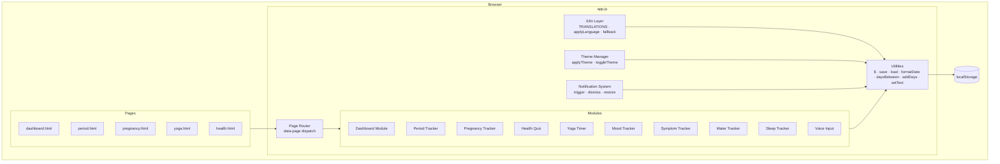

# Design Document: Women's Health Tracker

## Overview

The Women's Health Tracker is a fully client-side web application built with vanilla HTML, CSS, and JavaScript. It requires no backend, no user accounts, and no external dependencies. All data is persisted to the browser's `localStorage` as structured JSON. The app supports four languages (English, Tamil, Tanglish, Hindi), a dark/light theme toggle, and a suite of health-tracking modules accessible from a central dashboard.

The architecture is intentionally simple: multiple HTML pages share a single `app.js` file. On each page load, the script reads the `data-page` attribute on `<body>` and calls the corresponding module initialisation function. A shared utility layer handles storage, i18n, theming, and DOM helpers.

---

## Architecture



### Key Architectural Decisions

- **Single JS file**: All modules live in `app.js`. The `data-page` attribute on `<body>` acts as a lightweight router, calling the right `init*()` function on `DOMContentLoaded`.
- **No framework**: DOM manipulation uses the `$()` helper (`document.querySelector` alias). Event delegation is used where multiple similar elements exist.
- **localStorage as the database**: All reads go through a `load(key, default)` helper that catches JSON parse errors and returns the default. All writes go through `save(key, value)` which calls `JSON.stringify`.
- **CSS custom properties for theming**: The `data-theme` attribute on `<html>` switches between two sets of CSS variable values. No JS class toggling needed beyond setting the attribute.
- **TRANSLATIONS object for i18n**: A single nested object keyed by language code then by string key. `applyLanguage()` walks all `[data-i18n]` elements and sets their text content.

---

## Components and Interfaces

### Utility Layer

```js
// DOM helper
$(selector, ctx = document) => Element

// Storage
save(key: string, value: any): void          // JSON.stringify → localStorage
load(key: string, defaultValue: any): any    // JSON.parse with error fallback

// Date helpers
formatDate(date: Date): string               // 'YYYY-MM-DD'
daysBetween(a: Date, b: Date): number        // signed integer
addDays(date: Date, n: number): Date

// Text
setText(selector: string, text: string): void
```

### i18n Layer

```js
// TRANSLATIONS shape
const TRANSLATIONS = {
  en: { key: "string", ... },
  ta: { key: "string", ... },
  tanglish: { key: "string", ... },
  hi: { key: "string", ... }
}

applyLanguage(lang: string): void
// Walks all [data-i18n] elements, sets textContent from TRANSLATIONS[lang][key]
// Falls back to TRANSLATIONS['en'][key] if key missing in selected lang

t(key: string): string
// Returns translated string for current language with English fallback
```

### Theme Manager

```js
applyTheme(theme: 'light' | 'dark'): void
// Sets data-theme attribute on <html>, saves to localStorage

toggleTheme(): void
```

### Notification System

```js
// Notification shape stored in localStorage under 'notifications'
type Notification = {
  id: string,
  type: 'period' | 'pregnancy' | 'hydration',
  message: string,
  dismissed: boolean
}

triggerNotification(notification: Notification): void
dismissNotification(id: string): void
restoreNotifications(): void   // called on page load
renderNotificationBanner(): void
```

### Period Tracker Module

```js
initPeriodTracker(): void

// Reads/writes localStorage key: 'periodData'
type PeriodData = {
  startDate: string,    // 'YYYY-MM-DD'
  cycleLength: number,  // days
  duration: number      // days
}

calculateNextPeriod(data: PeriodData): Date
calculateDaysRemaining(nextPeriod: Date): number
isDelayed(nextPeriod: Date): boolean
daysLate(nextPeriod: Date): number
validateCycleLength(n: number): ValidationResult
validateDuration(n: number): ValidationResult
```

### Pregnancy Tracker Module

```js
initPregnancyTracker(): void

// Reads/writes localStorage key: 'pregData'
type PregData = {
  lmpDate: string   // 'YYYY-MM-DD'
}

calculateWeek(lmpDate: Date): number        // floor((today - lmp) / 7)
calculateTrimester(week: number): 1 | 2 | 3
calculateEDD(lmpDate: Date): Date           // lmp + 280 days
getBabySize(week: number): string           // from predefined mapping
```

### Health Quiz Module

```js
initHealthQuiz(): void

// Reads/writes localStorage key: 'quizData'
type QuizData = {
  result: string,
  completedDate: string
}

type Question = { id: number, text: string, options: string[] }
type Answer = { questionId: number, value: number }

evaluateQuiz(answers: Answer[]): QuizResult
// Returns { condition: string, likelihood: string }
```

### Yoga Timer Module

```js
initYogaTimer(): void

// Reads/writes localStorage key: 'yogaSessions'
type YogaSession = {
  date: string,
  durationSeconds: number
}

startTimer(): void
stopTimer(): YogaSession
```

### Mood Tracker Module

```js
initMoodTracker(): void

// Reads/writes localStorage key: 'mood'
// Value: Record<string, string>  (date → emoji)

logMood(emoji: string): void
getTodayMood(): string | null
```

### Symptom Tracker Module

```js
initSymptomTracker(): void

// Reads/writes localStorage key: 'symptoms'
type SymptomEntry = {
  date: string,
  tags: string[]
}

logSymptoms(tags: string[]): void
getHistory(): SymptomEntry[]   // sorted descending by date
```

### Water Tracker Module

```js
initWaterTracker(): void

// Reads/writes localStorage key: 'waterCount'
// Value: { date: string, count: number }

logGlass(): void
resetIfNewDay(): void
isGoalMet(): boolean
```

### Sleep Tracker Module

```js
initSleepTracker(): void

// Reads/writes localStorage key: 'sleepHours'
// Value: { date: string, hours: number }

logSleep(hours: number): void
validateSleepHours(hours: number): ValidationResult
getProgressPercent(hours: number): number   // (hours / 8) * 100, capped at 100
```

### Voice Input Module

```js
initVoiceInput(): void

isSupported(): boolean   // typeof SpeechRecognition !== 'undefined'
attachToField(inputEl: HTMLInputElement): void
// Adds mic button adjacent to input; hides it if not supported
```

---

## Data Models

All data is stored in `localStorage` as JSON strings. The following table summarises every key used by the app.

| Key | Type | Description |
|-----|------|-------------|
| `lang` | `string` | Selected language code: `'en'`, `'ta'`, `'tanglish'`, `'hi'` |
| `theme` | `string` | Selected theme: `'light'` or `'dark'` |
| `periodData` | `PeriodData` | Most recent period log entry |
| `pregData` | `PregData` | LMP date for pregnancy tracking |
| `quizData` | `QuizData` | Last quiz result and completion date |
| `yogaSessions` | `YogaSession[]` | Array of completed yoga sessions |
| `mood` | `Record<string, string>` | Map of `'YYYY-MM-DD'` → emoji string |
| `symptoms` | `SymptomEntry[]` | Array of symptom log entries |
| `waterCount` | `{ date: string, count: number }` | Today's water glass count |
| `sleepHours` | `{ date: string, hours: number }` | Most recent sleep log |
| `notifications` | `Notification[]` | Active and dismissed notifications |

### Validation Result Type

```js
type ValidationResult = {
  valid: boolean,
  message?: string   // i18n key for the warning/error string
}
```

### Baby Size Mapping (sample)

```js
const BABY_SIZE = {
  4: 'poppy seed', 8: 'raspberry', 12: 'lime',
  16: 'avocado', 20: 'banana', 24: 'corn',
  28: 'eggplant', 32: 'squash', 36: 'honeydew', 40: 'watermelon'
  // ... full mapping in app.js
}
```

### Health Quiz Scoring Rubric (structure)

```js
const QUIZ_RUBRIC = {
  PCOS:     { questions: [0,1,2], threshold: 2 },
  Anemia:   { questions: [1,3,4], threshold: 2 },
  Thyroid:  { questions: [2,3,4], threshold: 2 },
  Stress:   { questions: [0,2,4], threshold: 2 }
}
```

---

## Correctness Properties

*A property is a characteristic or behavior that should hold true across all valid executions of a system — essentially, a formal statement about what the system should do. Properties serve as the bridge between human-readable specifications and machine-verifiable correctness guarantees.*


### Property 1: i18n Translation Completeness and Fallback

*For any* language code and any i18n key, `t(key)` must return `TRANSLATIONS[lang][key]` when that entry exists, and must fall back to `TRANSLATIONS['en'][key]` when the key is absent in the selected language. The result must never be `undefined` or empty for any key that exists in the English translations.

**Validates: Requirements 1.2, 1.4**

---

### Property 2: Theme Attribute Consistency

*For any* theme value (`'light'` or `'dark'`), calling `applyTheme(theme)` must set `document.documentElement.dataset.theme` to that value. Calling `toggleTheme()` twice in succession must return the `data-theme` attribute to its original value (round-trip idempotence).

**Validates: Requirements 2.1, 2.2**

---

### Property 3: Period Next-Date Calculation

*For any* valid `PeriodData` with a `startDate` and `cycleLength`, `calculateNextPeriod(data)` must return a date exactly `cycleLength` days after `startDate`.

**Validates: Requirements 4.2**

---

### Property 4: Period Delay Detection

*For any* next-period date that is strictly in the past relative to today, `isDelayed()` must return `true` and `daysLate()` must return a positive integer equal to `daysBetween(nextPeriod, today)`.

**Validates: Requirements 4.4**

---

### Property 5: Cycle Length Validation Range

*For any* integer `n`, `validateCycleLength(n)` must return `valid: false` when `n < 21` or `n > 35`, and `valid: true` when `21 <= n <= 35`.

**Validates: Requirements 4.5**

---

### Property 6: Period Duration Validation Range

*For any* integer `n`, `validateDuration(n)` must return `valid: false` when `n < 2` or `n > 7`, and `valid: true` when `2 <= n <= 7`.

**Validates: Requirements 4.6**

---

### Property 7: Pregnancy Week Calculation

*For any* `lmpDate` in the past, `calculateWeek(lmpDate)` must return `Math.floor(daysBetween(lmpDate, today) / 7)`. For any `lmpDate` in the future, the result must be negative, signalling an invalid date.

**Validates: Requirements 5.1, 5.6**

---

### Property 8: Trimester Determination

*For any* week number `w`, `calculateTrimester(w)` must return `1` when `1 <= w <= 12`, `2` when `13 <= w <= 26`, and `3` when `27 <= w <= 40`.

**Validates: Requirements 5.2**

---

### Property 9: Estimated Delivery Date Calculation

*For any* valid `lmpDate`, `calculateEDD(lmpDate)` must return a date exactly 280 days after `lmpDate`.

**Validates: Requirements 5.3**

---

### Property 10: Quiz Evaluation Determinism

*For any* fixed set of 5 answers, `evaluateQuiz(answers)` must always return the same result (deterministic). The returned `condition` must be one of `'PCOS'`, `'Anemia'`, `'Thyroid'`, `'Stress'`, or a defined "no condition" sentinel value.

**Validates: Requirements 6.2**

---

### Property 11: Mood One-Entry-Per-Day

*For any* sequence of `logMood()` calls on the same calendar day, `load('mood')[today]` must equal only the most recently logged emoji. The mood map must contain exactly one entry per calendar day regardless of how many times mood is logged that day.

**Validates: Requirements 8.4**

---

### Property 12: Symptom History Sort Order

*For any* collection of symptom entries with distinct dates, `getHistory()` must return them sorted by date in strictly descending order (most recent first).

**Validates: Requirements 9.3**

---

### Property 13: Water Count Increment

*For any* current water count `c`, calling `logGlass()` must result in the stored count being exactly `c + 1`.

**Validates: Requirements 11.2**

---

### Property 14: Water Goal Detection

*For any* count value `c >= 8`, `isGoalMet()` must return `true`. For any `c < 8`, it must return `false`.

**Validates: Requirements 11.3**

---

### Property 15: Water Count Daily Reset

*For any* stored water record whose `date` differs from today's date, calling `resetIfNewDay()` must set the count to `0` and update the stored date to today.

**Validates: Requirements 11.4**

---

### Property 16: Sleep Progress Percentage

*For any* sleep duration `h` where `0 <= h <= 24`, `getProgressPercent(h)` must return `Math.min((h / 8) * 100, 100)`.

**Validates: Requirements 12.2**

---

### Property 17: Sleep Duration Validation Range

*For any* number `h`, `validateSleepHours(h)` must return `valid: false` when `h < 0` or `h > 24`, and `valid: true` when `0 <= h <= 24`.

**Validates: Requirements 12.3**

---

### Property 18: Notification Dismissal Round-Trip

*For any* notification, after calling `dismissNotification(id)`, the notification must appear in `load('notifications')` with `dismissed: true`, and must not appear in the list returned by `getActiveNotifications()`.

**Validates: Requirements 13.3**

---

### Property 19: JSON Persistence Round-Trip

*For any* serialisable app data object `v` and storage key `k`, calling `save(k, v)` followed by `load(k, null)` must return an object deeply equal to `v`.

**Validates: Requirements 14.1, 14.2**

---

### Property 20: Malformed JSON Fallback

*For any* localStorage key containing a string that is not valid JSON, `load(key, defaultValue)` must return `defaultValue` without throwing an exception.

**Validates: Requirements 14.3**

---

### Property 21: Data Reset Clears All Keys

*For any* app state, after triggering the data reset control, every app-defined localStorage key (`lang`, `theme`, `periodData`, `pregData`, `quizData`, `yogaSessions`, `mood`, `symptoms`, `waterCount`, `sleepHours`, `notifications`) must be absent from localStorage or set to its default value.

**Validates: Requirements 14.4**

---

## Error Handling

### Storage Errors

- `load(key, default)` wraps `JSON.parse` in a try/catch. On any parse error it logs a console warning and returns `default`. This satisfies Requirement 14.3.
- `save(key, value)` wraps `localStorage.setItem` in a try/catch to handle `QuotaExceededError`. On failure it shows a toast notification informing the user that storage is full.

### Input Validation

All user-facing validation errors are surfaced inline (adjacent to the offending field) using i18n message keys so they render in the selected language. Validation functions return `{ valid: boolean, message?: string }` and never throw.

| Module | Invalid condition | Response |
|--------|------------------|----------|
| Period Tracker | cycleLength < 21 or > 35 | Inline warning (non-blocking) |
| Period Tracker | duration < 2 or > 7 | Inline warning (non-blocking) |
| Pregnancy Tracker | lmpDate in the future | Inline error, block save |
| Pregnancy Tracker | week > 40 | Inline warning, advise provider |
| Sleep Tracker | hours < 0 or > 24 | Inline error, block save |

### Voice Input Errors

When `SpeechRecognition` fires an `onerror` event, the module restores the input field to its pre-recognition value and displays an inline error message using the `voiceError` i18n key.

### Missing Translation Keys

`t(key)` always returns a string. If the key is missing in both the selected language and English, it returns the key itself as a last-resort fallback, ensuring the UI never renders `undefined`.

---

## Testing Strategy

### Dual Testing Approach

Both unit tests and property-based tests are required. They are complementary:

- **Unit tests** cover specific examples, integration points, edge cases, and UI rendering checks.
- **Property-based tests** verify universal correctness across all valid inputs, catching edge cases that hand-written examples miss.

### Property-Based Testing

**Library**: [fast-check](https://github.com/dubzzz/fast-check) (JavaScript, no build step required via CDN or npm).

Each correctness property defined above must be implemented as a single `fc.assert(fc.property(...))` test. Tests must run a minimum of **100 iterations** each.

Each test must include a comment tag in the format:

```
// Feature: women-health-tracker, Property N: <property title>
```

Example:

```js
// Feature: women-health-tracker, Property 5: Cycle Length Validation Range
fc.assert(
  fc.property(fc.integer(), (n) => {
    const result = validateCycleLength(n);
    if (n < 21 || n > 35) return result.valid === false;
    return result.valid === true;
  }),
  { numRuns: 100 }
);
```

### Unit Tests

Unit tests should focus on:

- **Specific examples**: quiz scoring with known answer sets, baby size lookup for specific weeks, dashboard rendering with known localStorage state.
- **Edge cases**: week 0 pregnancy, exactly 8 glasses of water, sleep duration of exactly 0 or 24, mood logged at midnight boundary.
- **Integration**: page init functions correctly read localStorage and populate the DOM.
- **Voice input**: `isSupported()` returns correct value based on `SpeechRecognition` availability; mic button visibility.

Avoid writing unit tests that duplicate what property tests already cover (e.g., don't write 20 individual cycle-length validation examples when the property test covers all integers).

### Test File Structure

```
tests/
  unit/
    utils.test.js          # save, load, formatDate, daysBetween, addDays, t()
    period.test.js         # calculateNextPeriod, validateCycleLength, validateDuration
    pregnancy.test.js      # calculateWeek, calculateTrimester, calculateEDD, getBabySize
    quiz.test.js           # evaluateQuiz, question count, disclaimer presence
    mood.test.js           # logMood, one-per-day overwrite
    symptoms.test.js       # logSymptoms, getHistory sort order
    water.test.js          # logGlass, isGoalMet, resetIfNewDay
    sleep.test.js          # logSleep, validateSleepHours, getProgressPercent
    notifications.test.js  # dismissNotification, getActiveNotifications
    voice.test.js          # isSupported, attachToField visibility
  property/
    i18n.property.test.js
    theme.property.test.js
    period.property.test.js
    pregnancy.property.test.js
    quiz.property.test.js
    mood.property.test.js
    symptoms.property.test.js
    water.property.test.js
    sleep.property.test.js
    notifications.property.test.js
    storage.property.test.js
```
